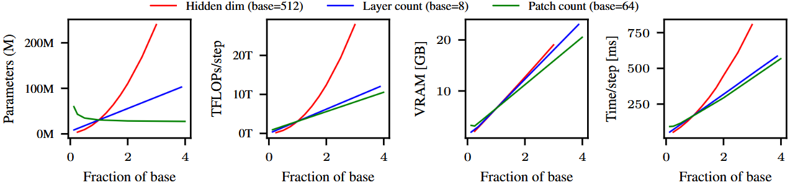

# A Simple Transformer Pipeline for Full-Key Side-Channel Attacks on Uncropped Datasets

Anonymous artifact submission to OPTIMIST 2026.

This repository provides a reproducible PyTorch pipeline for training, hyperparameter tuning, and evaluation of transformers for full-key profiled physical side-channel attacks on uncropped power and electromagnetic traces.

**Intended users:** DLSCA researchers working on uncropped attacks who want pretrained models without doing costly training/hyperparameter tuning, a simple and performant backbone to extend, or a reproducible baseline for boilerplate transformer-based attacks.

## Overview

This repository implements a deliberately simple transformer baseline for profiled physical side-channel attacks against cryptographic hardware which target uncropped traces without cropping or feature selection, and simultaneously predict all key bytes. We use the standard pre-norm transformer backbone that is common in other domains, adapting only the input and output layers to the side-channel setting. Our code is built on PyTorch, PyTorch Lightning, and Optuna.

We support training, evaluation, and hyperparameter tuning on the uncropped variants of ASCADv1f, ASCADv1r, and CHES-CTF-2018 when targeting all bytes of the first SubBytes output. We provide both training recipes to reproduce our reported results, as well as pretrained models. We expect our code to be extensible to other settings as well.

Our repository structure is summarized below. In `src/uncropped_transformers` we store pip-installable modular library code (e.g. neural nets, training methods, dataset wrappers, evaluation methods) designed to be imported into other projects. We store our project-specific code (e.g. entrypoints, PyTorch/Matplotlib configuration, directory creation) separately in the `experiments` directory.

```
.
├── config                      # YAML config files for dataset, model, and training settings/hyperparameters.
├── outputs                     # Directory for experiment outputs.
├── datasets                    # Directory for dataset files and preprocessing caches.
├── experiments                 # Entrypoints and infrastructure for experiments, and project-specific code.
└── src                         # Reusable importable library code.
    ├── uncropped_transformers
    │   ├── datasets            # Dataset loading and preprocessing.
    │   ├── evaluation          # Accuracy, rank, MTD metrics.
    │   ├── models              # Neural net architectures and building blocks.
    │   ├── training            # Training loops and hyperparameter tuning methods.
```

### Resource requirements

| Dataset | VRAM (required) | RAM (recommended) | Wall clock time |
| --- | --- | --- | --- |
| ASCADv1 (fixed key) | 8.78GB | 16GB | 3.34h |
| ASCADv1 (variable key) | 9.07GB | 96GB | 2.80h |
| CHES-CTF-2018 | 4.20GB | 32GB | 0.360h |

Wall clock time is reported with our recommended training recipes on a machine with an NVIDIA A6000 GPU (49GB VRAM), AMD Ryzen Threadripper PRO 5965WX CPU, and 128GB of RAM. We recommend running on a machine with sufficient RAM for the OS to cache 1 copy of the dataset, as time to load traces from the filesystem is significant for uncropped datasets and may bottleneck performance.

## Installation

This code was tested using Python 3.11.15. Follow the instructions below to install the project and its dependencies:
1. Create and activate an environment for the project. For example, to do this with [micromamba](https://mamba.readthedocs.io/en/latest/installation/micromamba-installation.html):
```bash
micromamba create --name uncropped-transformers python=3.11
micromamba activate uncropped-transformers
```
2. Clone the project, then install it alongside its dependencies (reviewers: download from anonymous github instead of cloning):
```bash
git clone git@github.com:redacted-username/redacted-reponame
cd redacted-reponame
pip install -e .
```

### Downloading datasets

You may download some or all of the following datasets by running the commands below from the project directory:
- ASCADv1 (fixed key) ([link](https://github.com/ANSSI-FR/ASCAD/tree/master/ATMEGA_AES_v1/ATM_AES_v1_fixed_key))
```bash
mkdir -p datasets/ascadv1_fixed
cd datasets/ascadv1_fixed
wget https://www.data.gouv.fr/api/1/datasets/r/e7ab6f9e-79bf-431f-a5ed-faf0ebe9b08e -O ASCAD_data.zip
unzip ASCAD_data.zip
```
- ASCADv1 (variable key) ([link](https://github.com/ANSSI-FR/ASCAD/tree/master/ATMEGA_AES_v1/ATM_AES_v1_variable_key))
```bash
mkdir -p datasets/ascadv1_variable
cd datasets/ascadv1_variable
wget https://www.data.gouv.fr/api/1/datasets/r/3217dcc0-184f-402b-8914-e31cc120c51c -O atmega8515-raw-traces.h5
```
- CHES-CTF-2018 ([link](https://zenodo.org/records/3733418#.Yc2iq1ko9Pa))
```bash
mkdir -p datasets/ches_ctf_2018
cd datasets/ches_ctf_2018
wget https://zenodo.org/records/3733418/files/PinataAcqTask2.1_10k_upload.trs
wget https://zenodo.org/records/3733418/files/PinataAcqTask2.2_10k_upload.trs
wget https://zenodo.org/records/3733418/files/PinataAcqTask2.3_10k_upload.trs
wget https://zenodo.org/records/3733418/files/PinataAcqTask2.4_10k_upload.trs
wget https://zenodo.org/records/3733418/files/PinataAcqTask2.5_1k_NK_upload.trs
wget https://zenodo.org/records/3733418/files/PinataAcqTask2.6_1k_NK_upload.trs
```

### One-time dataset validation and preprocessing

The first time a dataset is initialized, our code will run checksum validation, copy traces to a binary file to enable faster dataloading, and cache the per-feature mean and variance on the profiling set. We recommend running the following commands from the project directory to complete this step once before training with multiprocessing. 
- ASCADv1 (fixed key); expected runtime: 30 sec.
```bash
python - <<'PY'
from uncropped_transformers.datasets.ascadv1 import ASCADv1_NumpyDataset
ASCADv1_NumpyDataset(root='./datasets/ascadv1_fixed', partition='profile', variable_key=False).get_trace_statistics(use_progress_bar=True)
ASCADv1_NumpyDataset(root='./datasets/ascadv1_fixed', partition='attack', variable_key=False)
PY
```
- ASCADv1 (variable key); expected runtime: 40 min.
```bash
python - <<'PY'
from uncropped_transformers.datasets.ascadv1 import ASCADv1_NumpyDataset
ASCADv1_NumpyDataset(root='./datasets/ascadv1_variable', partition='profile', variable_key=True).get_trace_statistics(use_progress_bar=True)
ASCADv1_NumpyDataset(root='./datasets/ascadv1_variable', partition='attack', variable_key=True)
PY
```
- CHES-CTF-2018; expected runtime: 3 min.
```bash
python - <<'PY'
from uncropped_transformers.datasets.ches_ctf_2018 import CHESCTF2018_NumpyDataset
CHESCTF2018_NumpyDataset(root='./datasets/ches_ctf_2018', partition='profile').get_trace_statistics(use_progress_bar=True)
CHESCTF2018_NumpyDataset(root='./datasets/ches_ctf_2018', partition='attack')
PY
```

### Downloading pretrained models

Pretrained models can be downloaded (1.4GB) from [this](https://drive.google.com/file/d/11Xx1D3CkgxK8cUF2JDmEpG3Bhgd6R8Ow/view?usp=sharing) Google Drive link (for the non-anonymous repo I'll host the files on HuggingFace so they can be downloaded from the command line). Then move the downloaded zip file to the project directory and run
```bash
unzip pretrained-models.zip
```
This will result in the following directory structure (the same as what would result from training + evaluating from scratch as described in the next section):
```
./outputs/
├── ascadv1_fixed
│   └── demo_run
│       ├── best_val_rank.ckpt      # PyTorch Lightning checkpoint after the epoch with the best rank on valset
│       ├── latest.ckpt             # PyTorch Lightning checkpoint after the final epoch
│       ├── metrics.csv             # Log of train/val loss, rank, accuracy after each epoch
│       ├── config.yaml             # Log listing settings for reproducibility: hyperparameters, seed, git commit hash, etc.
│       ├── training_curves.pdf     # Plots of train/val loss, rank, accuracy vs. training step
│       ├── attack_performance.pdf  # Plots of correct key model test rank vs. traces seen, per-byte MTD
│       ├── attack_metrics.npz      # Cached performance metrics after evaluation of best model
│       └── hparams.yaml            # Subset of config.yaml, used by Lightning for loading checkpoints
├── ascadv1_variable
│   └── demo_run
│       ├── "
└── ches_ctf_2018
    └── demo_run
        ├── "
```

## Usage instructions

Entrypoints for running and evaluating experiments are stored in the `./experiments` directory. This directory also contains experiment-specific infrastructure such as random seed initialization, initial PyTorch/Matplotlib configuration, directory structure/initialization, and project-specific utility functions. Our results can be reproduced as follows:

### Configuration

Trial configurations should be stored in `./config` as YAML files. We provide reference configurations for ASCADv1-fixed, ASCADv1-variable, and CHES-CTF-2018 which reproduce our reported results, and you may use these as templates to create new configuration files with modified settings. These config files encode the following (see comments in reference configurations for additional details):
- Dataset configuration: e.g. targeted intermediate variable, preprocessing strategy, data augmentation, valset size
- Training hyperparameters: e.g. total steps, batch size, optimizer + learning rate scheduler hyperparameters, model selection metric
- Architecture hyperparameters: e.g. leakage model, depth/width/patch size, dropout rates, position embedding algorithm, sequence -> logits algorithm
- Search space: which hyperparameters to tune, from which values/ranges, and under what density function

### Training from scratch

Models can be trained by running the following command, where `CONFIG_FILE` is replaced with the name of a config file in `./config` without the `.yaml` suffix, and `DEST` is a path to the directory where checkpoints and logs should be saved:
```bash
python experiments/train_supervised_model.py \
    --config-file CONFIG_FILE \
    --dest DEST
```
For example, use the following commands to reproduce the training runs with our reported results:
- ASCADv1 (fixed key):
```bash
python experiments/train_supervised_model.py --config-file ascadv1_fixed --dest ./outputs/ascadv1_fixed/demo_run
```
- ASCADv1 (variable key):
```bash
python experiments/train_supervised_model.py --config-file ascadv1_variable --dest ./outputs/ascadv1_variable/demo_run
```
- CHES-CTF-2018:
```bash
python experiments/train_supervised_model.py --config-file ches_ctf_2018 --dest ./outputs/ches_ctf_2018/demo_run
```
This command will save the following files to `DEST`:
- `best_{metric_name}.ckpt`: the checkpoint of the best model according to `{metric_name}` (validation rank by default).
- `latest.ckpt`: the model checkpoint after the last epoch before training finished or was interrupted.
- `metrics.csv`: logs of metrics recorded after every training epoch (e.g. train/val loss, rank).
- `config.yaml`: a config file encoding settings/info for reproducibility -- e.g. hyperparameters (after loading the yaml and applying command-line overrides), the Git commit hash, random seed.
- `hparams.yaml`: a config file used internally by PyTorch Lightning for saving/loading checkpoints.

### Evaluating trained models on the attack set

The following command will compute, cache, and display a trained model's full-key and per-byte cross-entropy loss, accuracy, MTD, and correct-key rank on the test set, where `CKPT_PATH` is a path to a trained model checkpoint:
```bash
python experiments/evaluate_trained_model.py \
    --model-ckpt-path CKPT_PATH \
    --metrics attack-performance
```
This command assumes the checkpoint is stored in an experiment directory produced by our training script, which contains a `config.yaml` file. It will save the following files to this directory:
- `attack_metrics.npz`: a cache of the performance metrics computed on the attack set.

### Plotting training curves

The following command will visualize the logs of train/val loss, acc, rank over time, and cached attack performance metrics, where `RUN_DIR` is a path to an experiment directory produced by our training script:
```bash
python experiments/visualize_trained_model.py \
    --run-dir RUN_DIR
```
This command assumes that the files `metrics.csv` and `attack_metrics.npz` exist and will save the following files to this directory:
- `training_curves.pdf`: plots of the train/val loss, rank, accuracy vs. training steps.
- `attack_performance.pdf`: a plot of correct-key rank vs. traces seen on the attack set, and a visualization of the per-byte MTD.

### Tuning hyperparameters

## Additional results

### Full performance metrics

The table below supplements the targeted comparisons in our manuscript with complete per-byte and full-key results. 'Full key' denotes the accuracy or MTD when simultaneously predicting all bytes of the cryptographic key, and 'Byte $i$' denotes the accuracy or MTD for a single byte. MTD takes on non-integer values because we average it over 1k random permutations of the attack set.

| Dataset | Metric | Full key | Byte 0 | Byte 1 | Byte 2 | Byte 3 | Byte 4 | Byte 5 | Byte 6 | Byte 7 | Byte 8 | Byte 9 | Byte 10 | Byte 11 | Byte 12 | Byte 13 | Byte 14 | Byte 15 |
| --- | --- | ---: | ---: | ---: | ---: | ---: | ---: | ---: | ---: | ---: | ---: | ---: | ---: | ---: | ---: | ---: | ---: | ---: |
| ASCADv1-fixed | Accuracy (%) | 90.450 | 100.000 | 100.000 | 99.856 | 99.809 | 99.854 | 99.912 | 99.774 | 99.905 | 98.072 | 99.450 | 98.900 | 99.856 | 98.916 | 95.771 | 99.869 | 98.216 |
| ASCADv1-fixed | MTD | 1.114 | 1.000 | 1.000 | 1.004 | 1.004 | 1.001 | 1.001 | 1.000 | 1.000 | 1.022 | 1.010 | 1.012 | 1.002 | 1.011 | 1.055 | 1.004 | 1.023 |
| ASCADv1-variable | Accuracy (%) | 98.454 | 99.998 | 99.999 | 99.971 | 99.642 | 99.986 | 99.979 | 99.989 | 99.908 | 99.781 | 99.994 | 99.821 | 99.997 | 99.753 | 99.852 | 99.954 | 99.811 |
| ASCADv1-variable | MTD | 1.010 | 1.000 | 1.000 | 1.000 | 1.003 | 1.000 | 1.000 | 1.000 | 1.002 | 1.002 | 1.000 | 1.000 | 1.000 | 1.002 | 1.000 | 1.000 | 1.001 |
| CHES-CTF-2018 | MTD | 23.385 | 12.011 | 11.671 | 10.980 | 10.900 | 11.136 | 11.532 | 11.234 | 11.343 | 11.574 | 11.386 | 11.605 | 11.648 | 11.338 | 11.193 | 11.701 | 10.894 |

An important consideration for full-key attacks is that the per-byte performance does not fully determine the full-key performance, because the latter depends on the extent to which per-byte errors are correlated. We thus recommend future work report both full-key and per-byte performance.

 For example, let $A$ denote a model's full-key accuracy and $A_i$ denote its accuracy on byte $i$. Then we have
 ```math
 1 - \sum_i (1 - A_i) \leq A \leq \min_i A_i.
 ```
 For example, two bytes with 50% accuracy may be jointly predicted with 50% accuracy if their errors always occur on the same traces, 25% accuracy if their errors are uncorrelated, or 0% accuracy if their errors are fully disjoint. Similarly, if $M$ denotes the full-key MTD and $M_i$ denotes the MTD for byte $i$, we have
```math
M \geq \max_i M_i.
```
 For example, a model with $M_1 = M_2 = 100$ might have $M = 100$ if errors are perfectly correlated across permutations, or $M = 125$ if $M_1 = 100$ for every permutation but $M_2 = 50$ for half of permutations and $150$ for the other half.

### Computational cost and scaling behavior

Below we visualize how the computational cost of our method scales with key transformer architecture hyperparameters. We report the parameter count, floating point operations (FLOPs) per training step, peak VRAM usage during training, and wall clock time per step on our reference machine. We fix the minibatch size at 256. To avoid confounding due to filesystem speed, we generate random $2^{18}$-length traces directly in VRAM.



There are 2 noteworthy takeaways:
1. *Parameter count is an unreliable proxy for the computational cost of transformers.* As the patch count increases, FLOPs, peak VRAM, and wall-clock time increase, while the parameter count decreases. This is because smaller patches result in a smaller patch projection weight matrix, and the transformer block parameter counts do not depend on sequence length. We recommend future work report multiple complementary cost proxies rather than relying solely on parameter count: peak VRAM and wall-clock time are useful indicators of resource requirements to reproduce results in practice, FLOPs provides a hardware-agnostic measure of compute cost, and parameter count indicates storage space taken up by model weights and is useful for comparing models with similar architectures.
2. *Cost scales approximately linearly with patch count in our regime.* For a transformer with $L$ layers, hidden dimension $D$, and sequence length $N$, a forward pass requires
```math
O(\underbrace{LN^2 D}_{\text{self-attention}} + \underbrace{LND^2}_{\text{MLPs and linear projections}})
```
FLOPs. This scaling behavior suggests that the $O(LND^2)$ term is dominant. While self-attention is often cited as expensive due to scaling quadratically with sequence length, for us its cost appears small compared to other components of the architecture. This is likely due to our large patch size which leads to relatively short sequence lengths, and our simple architecture which allows us to benefit from flash attention.

## Citation

If you use this code or our work, we would appreciate a citation:
```bibtex
(redacted for anonymous submission)
```

### Contact

If you have questions or want to point out bugs, don't hesitate to open an issue or contact me at `redacted`.
